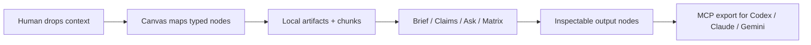

# Starlight Agent Canvas

OSS-first, MCP-native research and workflow canvas for Codex, Claude, Gemini, creators, and Starlight systems.

This is not a Poppy or Nodeflow clone. It is a local-first agent context layer: sources, prompts, MCP tools, agent runs, and outputs become typed nodes on a portable canvas.


## Why It Exists

Most AI canvases make research visible for a human but awkward for local agents. Starlight Agent Canvas is built as a shared context surface: you can paste/drop material visually, and Codex/Claude/Gemini can use the same canvas through safe MCP tools.

## How It Works



The web app and MCP server operate over the same local data home. A source added by you in the canvas is visible to an agent through MCP; a node added by Codex appears back in the same graph.

## What You Can Drop

| Input | v0.1 behavior | Notes |
| --- | --- | --- |
| YouTube URL | Title/captions when available, manual transcript fallback, `source_youtube` node, chunks, citations | Transcript-first; no video download |
| Loom/Vimeo/Wistia/TikTok/Drive/Dropbox/direct video URL | Safe video reference plus attached notes, provenance metadata, chunks | Use notes/transcripts for analysis until provider transcript adapters land |
| Public web URL | Bounded fetch into a URL artifact, or safe reference fallback | Private/localhost targets blocked by default |
| PDF upload | Local text extraction into a PDF artifact | File size capped |
| Markdown/text/JSON/CSV/log | Local source artifact with chunks | Works without model keys |
| Human note | Editable graph node and source context | First-class, not just annotation |

## First Ten Minutes

1. Run `node scripts/setup.mjs`.
2. Open `http://localhost:3000`.
3. Confirm the in-app `Setup / MCP` panel.
4. Click `New` for a fresh blank graph, `Demo` for a working proof canvas, or `Video`, `Web`, `Note`, or `Ask` to start from your own material.
5. Paste/drop context and choose `Map + Brief`, `Claims`, `Ask`, or `Map only`.
6. Inspect the selected source receipt: kind, ingest method, chunks, URL/file, chars.
7. Click `Context` or use MCP `export_canvas` with `format: "context"` for agent handoff.

## What v0.1 Does

- Create local canvases with portable JSON import/export, Markdown handoff exports, and agent context packets.
- Drop or paste URLs, YouTube links, transcripts, PDFs, text/Markdown/JSON/CSV files, and raw notes.
- Use the canvas itself as the intake surface: paste into the top composer, paste anywhere on the canvas, drop files/links, or double-click blank space for a note.
- Create a fresh blank canvas from the first viewport, and click an empty primary intake action to focus the composer instead of hitting a dead disabled state.
- Preview detected intake types before mapping, including video source, web source, source notes, text source, PDF, and file paths.
- Treat non-YouTube video links as safe video references with attached notes and preserved `media: video_reference` provenance.
- Choose the first pass before capture: `Map + Brief` by default, or `Claims`, `Ask`, and `Map only` when you want raw source nodes first.
- Store ingested sources as durable artifacts plus typed canvas nodes with provenance metadata, source chunks, and citation-ready ids.
- Ingest public URL text with bounded fetches; use Firecrawl only when explicitly requested.
- Ingest YouTube links with title lookup, best-effort public captions, and manual transcript fallback.
- Run local actions from intake, selected sources, selected nodes, or the whole canvas: summarize, extract claims, compare sources, make a decision matrix, generate an implementation brief, and ask source-grounded questions with citation metadata.
- Drag nodes, persist positions, connect nodes directly, edit selected node titles/bodies, inspect a selected source receipt with ingest mode/chunks/provenance, run source-scoped actions, copy selected source context, export an agent-ready context packet, export the result, and re-import portable canvas JSON.
- Inspect local setup, data home, MCP build, and Codex MCP wiring from the in-app `Setup / MCP` panel.
- Auto-select and open newly created sources, notes, files, and action answers in the inspector so the captured context is immediately usable.
- Expose safe stdio MCP tools so coding agents can ingest positioned text/URL/YouTube/PDF sources, update nodes, run actions, import portable context, search artifacts, and export canvas state.
- Keep runtime data outside the repo by default.

## Quick Start

From a GitHub clone:

```powershell
# Use the clone URL from this repository's GitHub Code button or project release page.
git clone <repo-url>
cd starlight-agent-canvas
corepack enable
corepack prepare pnpm@11.7.0 --activate
node scripts/setup.mjs
pnpm dev
```

For a cautious first run that skips dependency install because you already ran it:

```powershell
pnpm install
node scripts/setup.mjs --skip-install
pnpm dev
```

`node scripts/setup.mjs` runs dependency install, doctor, MCP build, MCP smoke, Starlight OS canvas seed, and a dry-run Codex MCP config print. Use `node scripts/setup.mjs --codex-write` when you want it to update `~/.codex/config.toml` with a timestamped backup.

`pnpm doctor` now verifies local prerequisites, workspace files, the built MCP server, `.mcp.json`, and whether Codex is wired to this exact MCP CLI path and `AGENT_CANVAS_HOME`.

Manual setup remains available:

```powershell
pnpm install
pnpm doctor
pnpm mcp:build
pnpm mcp:smoke
pnpm canvas:smoke
pnpm seed:starlight
pnpm dev
```

From Frank's local estate:

```powershell
cd C:\Users\frank\starlight\repos\starlight-agent-canvas
pnpm setup:local -- --skip-install --codex-write
pnpm dev
```

The web app starts at `http://localhost:3000` unless Next.js chooses another port.
API routes are localhost-only unless `AGENT_CANVAS_ALLOW_REMOTE=1` is set intentionally.

Try the portable demo:

```text
Open the app -> Demo -> inspect the selected YouTube source receipt -> click Context.
```

Manual portable import is still available from `Import -> examples/demo-canvas.json`.

The demo proves YouTube/manual transcript context, URL notes, human notes, source artifacts, chunk ids, Map + Brief output, and Codex context handoff. See `docs/demo-walkthrough.md`.

Optional local data path:

```powershell
$env:AGENT_CANVAS_HOME="C:\Users\frank\.starlight\agent-canvas"
```

Seed or refresh the Starlight operating canvas:

```powershell
pnpm seed:starlight
```

Run a production local preview:

```powershell
pnpm preview:prod
```

The production preview uses `http://127.0.0.1:3101`.

## MCP

```powershell
pnpm mcp:build
pnpm mcp:config -- --client codex
pnpm mcp:config -- --client json
pnpm mcp:install:codex
pnpm mcp:install:codex -- --write
pnpm mcp:smoke
```

`pnpm mcp:start` is only for manual stdio debugging. Normal MCP clients spawn the server from the generated config. For Codex-specific operating guidance, see `docs/codex-integration.md`.

Example MCP client entry:

```json
{
  "mcpServers": {
    "starlight-agent-canvas": {
      "command": "node",
      "args": [
        "/absolute/path/to/starlight-agent-canvas/packages/mcp/dist/cli.js"
      ],
      "env": {
        "AGENT_CANVAS_HOME": "/absolute/path/to/.starlight/agent-canvas"
      }
    }
  }
}
```

Run `pnpm mcp:config -- --client json` to print this block with paths for your machine.

## Local CLI

```powershell
pnpm canvas -- list
pnpm canvas -- demo
pnpm canvas -- export latest --format context --out .agent-canvas/demo-context.md
pnpm canvas -- search "Codex context handoff"
pnpm canvas:smoke
```

The CLI uses the same local data home as the web app and MCP server. It gives terminal users a safe way to import the demo, list local canvases, export JSON/Markdown/context, and search artifacts without opening the browser. See `docs/cli.md`.

## Verify

```powershell
pnpm doctor
pnpm release:audit
pnpm verify
pnpm canvas:smoke
pnpm mcp:smoke
pnpm test:e2e
```

`pnpm release:audit` checks GitHub/OSS files, install docs, required scripts, CI gates, demo canvas proof, visual evidence, env hygiene, and runtime-data safety. `pnpm verify` runs typecheck, unit/MCP tests, and production build. `pnpm doctor` verifies install and Codex wiring health. `pnpm canvas:smoke` proves terminal demo import, list, search, and context export. `pnpm mcp:smoke` proves stdio source ingest, node update, action, import, and JSON/Markdown/context export against a local throwaway data home. `pnpm test:e2e` runs the desktop/mobile Playwright workflow.

## Technology

- Next.js App Router, React, TypeScript, Tailwind.
- `@xyflow/react` typed workflow canvas.
- Zod schemas, chunked source artifacts, citations, and a local file-backed store in `packages/core`.
- Source adapters for URL fetch, optional Firecrawl, PDF extraction, YouTube oEmbed/captions, and manual text.
- `@modelcontextprotocol/sdk` stdio server in `packages/mcp`.
- Vercel AI SDK dependency for future provider adapters; v0.1 actions remain deterministic and keyless.
- Vitest, Playwright, security scan, CI, and visual QA evidence.

See `docs/technology-stack.md`, `docs/mcp-setup.md`, and `docs/production-readiness.md`.

Client examples and workflow prompts live in `examples/mcp`.

## Current Proof

- Last local verification date: `2026-07-02`.
- Latest committed product slice: use `git log --oneline -1`.
- Visual QA score: `28/30` in `docs/design-loop-evidence.json`.
- Evidence matrix: `docs/readiness-evidence.md`.
- Real UI captures: `docs/visual-qa/desktop-self-serve-video-intake.png`, `docs/visual-qa/desktop-self-serve-video-mapped.png`, `docs/visual-qa/mobile-self-serve-note-intake.png`.

## Docs

- Install and first run: `docs/install.md`
- PRD: `docs/prd.md`
- User flows: `docs/user-flows.md`
- Codex integration: `docs/codex-integration.md`
- Demo walkthrough: `docs/demo-walkthrough.md`
- Local CLI: `docs/cli.md`
- Release audit: `docs/release-audit.md`
- MCP setup: `docs/mcp-setup.md`
- System design: `docs/system-design.md`
- Technology stack: `docs/technology-stack.md`
- GitHub readiness: `docs/github-readiness.md`
- Readiness evidence: `docs/readiness-evidence.md`
- Production readiness: `docs/production-readiness.md`

## Repo Layout

- `apps/web`: Next.js workspace UI.
- `packages/core`: schemas, file store, ingestion, actions, import/export, and agent context packet generation.
- `packages/mcp`: safe stdio MCP server.
- `docs`: product brief, architecture, scene brief, evidence.
- `examples`: portable sample canvases.

## Safety

No v0.1 tool posts externally, scrapes social platforms, spends money, modifies external accounts, or deletes canvases. Runtime state lives in local files and can be inspected directly.

URL/PDF/video ingestion is bounded: private and localhost URLs are rejected for arbitrary URL fetches, remote fetches have timeout/size limits, PDFs are capped, YouTube transcript fetching is read-only/best-effort, and Firecrawl is used only when both `FIRECRAWL_API_KEY` exists and a request explicitly opts in.
