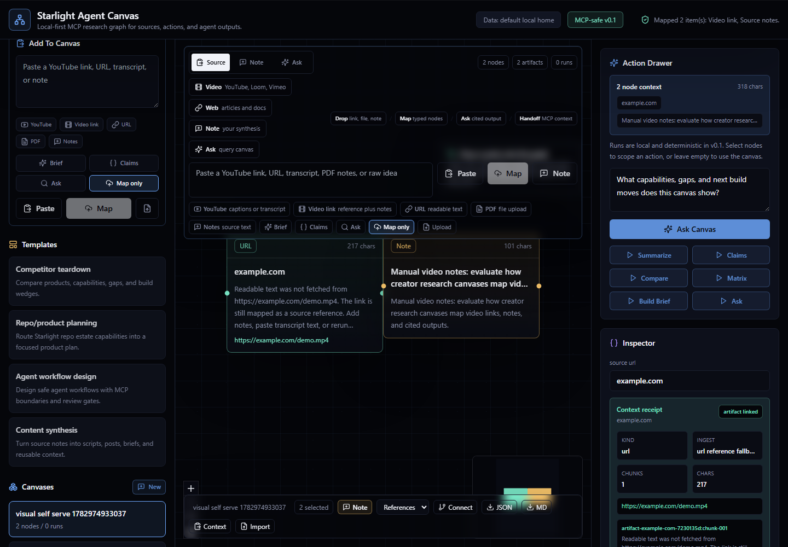
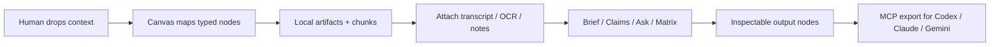

# Starlight Agent Canvas

[](https://github.com/frankxai/starlight-agent-canvas/actions/workflows/ci.yml)
[](LICENSE)

OSS-first, MCP-native research and workflow canvas for Codex, Claude, Gemini, creators, and Starlight systems.

This is not a Poppy or Nodeflow clone. It is a local-first agent context layer: sources, prompts, MCP tools, agent runs, and outputs become typed nodes on a portable canvas.



## Why It Exists

Most AI canvases make research visible for a human but awkward for local agents. Starlight Agent Canvas is built as a shared context surface: you can paste/drop material visually, and Codex/Claude/Gemini can use the same canvas through safe MCP tools.

## How It Works



The web app and MCP server operate over the same local data home. A source added by you in the canvas is visible to an agent through MCP; a node added by Codex appears back in the same graph.

## What You Can Drop

| Input | v0.1 behavior | Notes |
| --- | --- | --- |
| YouTube URL | Title/captions when available, manual transcript fallback, `source_youtube` node, chunks, citations | Transcript-first; no video download |
| Loom/Vimeo/Wistia/TikTok/Drive/Dropbox/direct video URL | Safe `source_video` node plus attached notes, `video` artifact, provenance metadata, chunks | Use notes/transcripts for analysis until provider transcript adapters land |
| Image URL or PNG/JPEG/WebP/GIF/AVIF upload | Safe `source_image` node plus image preview, `image` artifact, provenance metadata, chunks | Add notes/OCR text for analysis until provider vision adapters land |
| Public web URL | Bounded fetch into a URL artifact, or safe reference fallback | Private/localhost targets blocked by default |
| PDF upload | Local text extraction into a PDF artifact | File size capped |
| Markdown/text/JSON/CSV/log | Local source artifact with chunks | Works without model keys |
| Human note | Editable graph node and source context | First-class, not just annotation |

## First Ten Minutes

1. Run `node scripts/setup.mjs`.
2. Run `pnpm dev`.
3. Open `http://localhost:3000`.
4. Confirm the in-app `Setup / MCP` panel.
5. Click `New` for a fresh blank graph, `Demo` for a working proof canvas, or `Video`, `Image`, `Web`, `Note`, or `Ask` to start from your own material.
6. Use the live `Capture -> Map -> Inspect -> Ask -> Handoff` loop in the first viewport to see what is ready and trigger the next move.
7. Paste/drop context, confirm the `Map preview` node/artifact/readiness plan, then choose `Map + Brief`, `Claims`, `Ask`, or `Map only`.
8. Inspect the selected source receipt: kind, ingest method, chunks, URL/file, chars. If it is reference-only, the Action Drawer `Context gaps` lane points at the source; use `Attach context` to add transcript, OCR, visual notes, claims, or excerpts; chunks and readiness update immediately.
9. Click `Context` for a general agent packet, click `Codex` for a ready-to-paste Codex continuation prompt, or use MCP `export_canvas` with `format: "codex"` when Codex should resume through MCP. These packets include an intake trace manifest, and when nodes are selected the manifest is recomputed so unrelated canvas material stays out.

For the maintained first-success contract, run `pnpm first-success` or `pnpm first-success:json`.
For the full human plus agent operating loop, see `docs/operator-loop.md`.
For the install-to-Codex first success path, see `docs/activation.md`.

## What v0.1 Does

- Create local canvases with portable JSON import/export, Markdown handoff exports, agent context packets, and Codex-ready continuation prompts.
- Drop or paste URLs, YouTube links, image URLs/screenshots, transcripts, PDFs, text/Markdown/JSON/CSV files, and raw notes.
- Use the canvas itself as the intake surface: paste into the top composer, type into the desktop empty-canvas capture box, click `Paste & Map` to turn the clipboard into nodes immediately, paste anywhere on the canvas, drop files/links, or double-click blank space for a note.
- Keep mixed media context together: when a paste contains YouTube/video/image URLs followed by labeled transcript, notes, timestamps, OCR, alt text, or visual observations, those details attach to the matching source instead of becoming duplicate loose notes.
- Preview the map before committing: pasted YouTube/video/image/web/text shows the future node kind, artifact kind, readiness state, and whether the selected action will create an output node.
- Confirm every paste/drop/upload mapping with the latest intake receipt: created node kinds, artifact kinds, optional action output, and exact `Context` / `Codex` copy actions for the newly mapped material.
- Persist every paste/drop/upload mapping as an intake trace on the canvas: detected input kinds, source URLs, created node ids, artifact ids, readiness labels, optional run/output id, and scoped `Inspect`, `Context`, and `Codex` actions remain visible after refresh, through MCP `get_canvas`, and inside Context/Codex exports.
- Inspect source readiness on every selected source: `Codex-ready transcript`, `Codex-ready video notes`, `Codex-ready visual notes`, `Codex-ready PDF`, `URL reference saved`, or `Needs visual text`, with usable chars, chunks, ingest mode, and the next best action.
- See context gaps without hunting through nodes: the Action Drawer lists reference-only or needs-context sources and jumps straight to the `Attach context` panel.
- Attach context to an existing source from the inspector: paste transcript, timestamps, OCR, visual notes, claims, or excerpts into `Attach context` and the linked artifact chunks, source readiness, search, Ask, exports, and intake trace all update together.
- Follow a live operator loop in the first viewport: `Capture`, `Map`, `Inspect`, `Ask`, and `Handoff` update from actual canvas state and expose direct actions.
- Create a fresh blank canvas from the first viewport, and click an empty primary intake action to focus the composer instead of hitting a dead disabled state.
- Launch guided workflow templates with source slots, ordered stages, prompt nodes, expected output targets, and Codex/MCP handoff nodes; use the live Workflow Map to jump between stages.
- Preview detected intake types before mapping, including video source, image source, web source, source notes, text source, PDF, and file paths; active text input also shows the concrete node/artifact/readiness plan.
- Treat non-YouTube video links as first-class `source_video` nodes with attached notes, `video` artifacts, chunks, and preserved `media: video_reference` provenance.
- Treat image URLs and uploaded screenshots as first-class `source_image` nodes with image previews, `image` artifacts, chunks, and preserved `imageUrl` or `imageDataUrl` provenance.
- Choose the first pass before capture: `Map + Brief` by default, or `Claims`, `Ask`, and `Map only` when you want raw source nodes first.
- Store ingested sources as durable artifacts plus typed canvas nodes with provenance metadata, source chunks, and citation-ready ids.
- Ingest public URL text with bounded fetches; use Firecrawl only when explicitly requested.
- Ingest YouTube links with title lookup, best-effort public captions, and manual transcript fallback.
- Run local actions from intake, selected sources, selected nodes, or the whole canvas: summarize, extract claims, compare sources, make a decision matrix, generate an implementation brief, and ask source-grounded questions with citation metadata.
- Click answer citations or run-log citation chips to refocus the cited source node and highlighted chunk.
- Drag nodes, persist positions, connect nodes directly, edit selected node titles/bodies, inspect a selected source receipt with ingest mode/chunks/provenance, run source-scoped actions, copy selected source context, export selected or whole-canvas context/Codex handoff packets, export the result, and re-import portable canvas JSON.
- Inspect local setup, data home, MCP build, and Codex MCP wiring from the in-app `Setup / MCP` panel.
- Inspect the in-app Agent toolbelt for the Codex MCP path: `get_latest_canvas`, `ingest_anything`, `enrich_source_node`, `run_node_action`, and `export_canvas`, plus copy adoption report and terminal Codex handoff commands.
- Auto-select and open newly created sources, notes, files, and action answers in the inspector so the captured context is immediately usable.
- Expose safe stdio MCP tools so coding agents can get the latest canvas with source-readiness facts and persistent intake traces, ingest mixed pasted context with one `ingest_anything` call, ingest positioned text/URL/YouTube/video/image/PDF sources, enrich existing source nodes with transcript/OCR/notes, update nodes, run actions, import portable context, search artifacts, and export canvas state.
- Keep runtime data outside the repo by default.

## Quick Start

From a GitHub clone:

```powershell
git clone https://github.com/frankxai/starlight-agent-canvas.git
cd starlight-agent-canvas
corepack enable
corepack prepare pnpm@11.7.0 --activate
node scripts/setup.mjs
pnpm dev
```

For a cautious first run that skips dependency install because you already ran it:

```powershell
pnpm install
node scripts/setup.mjs --skip-install
pnpm dev
```

`node scripts/setup.mjs` runs dependency install, MCP build, doctor, MCP smoke, Starlight OS canvas seed, and a dry-run Codex MCP config print. Use `node scripts/setup.mjs --codex-write` when you want it to update `~/.codex/config.toml` with a timestamped backup.

`pnpm doctor` now verifies local prerequisites, workspace files, the built MCP server, `.mcp.json`, and whether Codex is wired to this exact MCP CLI path and `AGENT_CANVAS_HOME`.
`pnpm first-success` prints the maintained human plus Codex activation contract; `pnpm first-success:json` emits the same contract for agents, setup helpers, issue triage, and CI.
`pnpm adoption:report` turns doctor, release audit, demo proof, visual evidence, GitHub metadata, and Codex MCP status into one human-readable adoption snapshot; `pnpm adoption:report:json` emits the same contract for agents and CI.

Manual setup remains available:

```powershell
pnpm install
pnpm doctor
pnpm mcp:build
pnpm mcp:smoke
pnpm canvas:smoke
pnpm seed:starlight
pnpm dev
```

From Frank's local estate:

```powershell
cd C:\Users\frank\starlight\repos\starlight-agent-canvas
pnpm setup:local -- --skip-install --codex-write
pnpm dev
```

The web app starts at `http://localhost:3000` unless Next.js chooses another port.
API routes are localhost-only unless `AGENT_CANVAS_ALLOW_REMOTE=1` is set intentionally.

Try the portable demo:

```text
Open the app -> Demo -> inspect the selected YouTube source receipt -> click Context.
```

Manual portable import is still available from `Import -> examples/demo-canvas.json`.

The demo proves YouTube/manual transcript context, URL notes, human notes, source artifacts, chunk ids, Map + Brief output, and Codex context handoff. See `docs/demo-walkthrough.md`.

Optional local data path:

```powershell
$env:AGENT_CANVAS_HOME="C:\Users\frank\.starlight\agent-canvas"
```

Seed or refresh the Starlight operating canvas:

```powershell
pnpm seed:starlight
```

Run a production local preview:

```powershell
pnpm preview:prod
```

The production preview uses `http://127.0.0.1:3101`.

## MCP

```powershell
pnpm mcp:build
pnpm mcp:config -- --client codex
pnpm mcp:config -- --client json
pnpm mcp:install:codex
pnpm mcp:install:codex -- --write
pnpm mcp:smoke
```

`pnpm mcp:start` is only for manual stdio debugging. Normal MCP clients spawn the server from the generated config. For Codex-specific operating guidance, see `docs/codex-integration.md`.

Example MCP client entry:

```json
{
  "mcpServers": {
    "starlight-agent-canvas": {
      "command": "node",
      "args": [
        "/absolute/path/to/starlight-agent-canvas/packages/mcp/dist/cli.js"
      ],
      "env": {
        "AGENT_CANVAS_HOME": "/absolute/path/to/.starlight/agent-canvas"
      }
    }
  }
}
```

Run `pnpm mcp:config -- --client json` to print this block with paths for your machine.

## Local CLI

```powershell
pnpm canvas -- list
pnpm canvas -- demo
pnpm canvas -- export latest --format context --out .agent-canvas/demo-context.md
pnpm canvas -- export latest --format codex --out .agent-canvas/demo-codex.md
pnpm canvas -- export latest --format codex --nodes source-youtube-nodeflow --out .agent-canvas/demo-selected-codex.md
pnpm canvas -- search "Codex context handoff"
pnpm canvas:smoke
```

The CLI uses the same local data home as the web app and MCP server. It gives terminal users a safe way to import the demo, list local canvases, export JSON/Markdown/context/Codex handoff for the full canvas or selected node ids, and search artifacts without opening the browser. See `docs/cli.md`.

For MCP agents, the shortest equivalent to the human paste-anything path is:

```text
get_latest_canvas
ingest_anything(content: "<YouTube/video/image/URL/text plus notes>", runAction: "summarize")
enrich_source_node(nodeId: "<reference-only source>", body: "<transcript/OCR/notes>", enrichmentKind: "transcript")
export_canvas(format: "codex")
```

`ingest_anything` uses the same grouping rules as the web composer, so nearby source-specific transcript/notes/OCR blocks stay attached to their YouTube, video, or image source for later Codex context. Use `enrich_source_node` later when the first paste only had a link and the transcript, OCR, excerpts, claims, or notes arrive afterward.

## Verify

```powershell
pnpm doctor
pnpm doctor:json
pnpm first-success
pnpm first-success:json
pnpm adoption:report
pnpm adoption:report:json
pnpm release:audit
pnpm verify
pnpm first-run:check
pnpm canvas:smoke
pnpm mcp:smoke
pnpm test:e2e
```

`pnpm first-success` is the explicit install-to-Codex success contract. `pnpm adoption:report` is the single adoption snapshot for humans and agents. It reads doctor JSON, first-success JSON, release audit JSON, demo canvas proof, visual evidence, Git/GitHub status, and Codex MCP path/home without mutating local data. `pnpm release:audit` checks GitHub/OSS files, install docs, required scripts, CI gates, first-success shape, demo canvas proof, visual evidence, env hygiene, and runtime-data safety. `pnpm verify` runs typecheck, unit/MCP tests, and production build. `pnpm doctor` verifies install and Codex wiring health; `pnpm doctor:json` emits the same health contract for agents, CI, and setup automation. `pnpm first-run:check` builds the production app, uses a temporary data home, starts a local preview, verifies setup status, imports the demo canvas, checks context export, proves mixed YouTube/video/image/web/text intake through `/api/canvases/:id/ingest/anything`, runs a local action, and shuts the preview down. `pnpm canvas:smoke` proves terminal demo import, list, search, context export, and Codex handoff export. `pnpm mcp:smoke` proves stdio source ingest, node update, action, import, and JSON/Markdown/context/Codex export against a local throwaway data home. `pnpm test:e2e` runs the desktop/mobile Playwright workflow.

## Technology

- Next.js App Router, React, TypeScript, Tailwind.
- `@xyflow/react` typed workflow canvas.
- Zod schemas, chunked source artifacts, citations, context packets, Codex handoff prompts, and a local file-backed store in `packages/core`.
- Source adapters for URL fetch, optional Firecrawl, image upload/reference artifacts, PDF extraction, YouTube oEmbed/captions, and manual text.
- `@modelcontextprotocol/sdk` stdio server in `packages/mcp`.
- Vercel AI SDK dependency for future provider adapters; v0.1 actions remain deterministic and keyless.
- Vitest, Playwright, security scan, CI, and visual QA evidence.

See `docs/technology-stack.md`, `docs/mcp-setup.md`, and `docs/production-readiness.md`.

Client examples and workflow prompts live in `examples/mcp`.

## Current Proof

- Last local verification date: `2026-07-02`.
- Latest committed product slice: use `git log --oneline -1`.
- Visual QA score: `28/30` in `docs/design-loop-evidence.json`.
- Adoption snapshot: `pnpm adoption:report`.
- Evidence matrix: `docs/readiness-evidence.md`.
- Real UI captures: `docs/visual-qa/desktop-self-serve-video-intake.png`, `docs/visual-qa/desktop-self-serve-video-mapped.png`, `docs/visual-qa/mobile-self-serve-note-intake.png`.

## Docs

- Install and first run: `docs/install.md`
- Activation runway: `docs/activation.md`
- First success contract: `docs/first-success.md`
- First success machine contract: `docs/first-success.contract.json`
- Adoption report: `docs/adoption-report.md`
- Human/agent operator loop: `docs/operator-loop.md`
- PRD: `docs/prd.md`
- User flows: `docs/user-flows.md`
- Codex integration: `docs/codex-integration.md`
- Demo walkthrough: `docs/demo-walkthrough.md`
- Local CLI: `docs/cli.md`
- Release audit: `docs/release-audit.md`
- MCP setup: `docs/mcp-setup.md`
- System design: `docs/system-design.md`
- Technology stack: `docs/technology-stack.md`
- GitHub readiness: `docs/github-readiness.md`
- Readiness evidence: `docs/readiness-evidence.md`
- Production readiness: `docs/production-readiness.md`
- Support: `SUPPORT.md`
- Security: `SECURITY.md`
- Governance: `GOVERNANCE.md`
- Code of conduct: `CODE_OF_CONDUCT.md`

## Repo Layout

- `apps/web`: Next.js workspace UI.
- `packages/core`: schemas, file store, ingestion, actions, import/export, and agent context packet generation.
- `packages/mcp`: safe stdio MCP server.
- `docs`: product brief, architecture, scene brief, evidence.
- `examples`: portable sample canvases.

## Safety

No v0.1 tool posts externally, scrapes social platforms, spends money, modifies external accounts, or deletes canvases. Runtime state lives in local files and can be inspected directly.

URL/PDF/video/image ingestion is bounded: private and localhost URLs are rejected for arbitrary URL fetches, remote fetches have timeout/size limits, PDFs and uploaded images are capped, image URLs are stored as references without fetching arbitrary binary content, YouTube transcript fetching is read-only/best-effort, and Firecrawl is used only when both `FIRECRAWL_API_KEY` exists and a request explicitly opts in.
