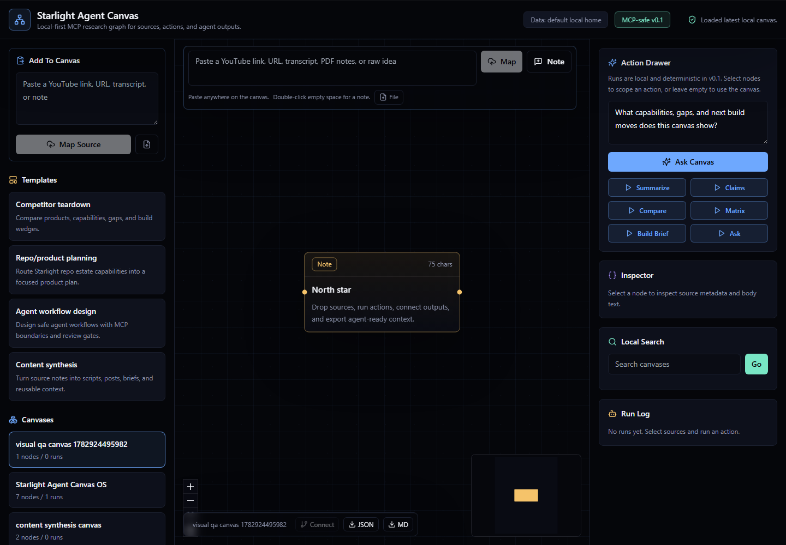

# Starlight Agent Canvas

OSS-first, MCP-native research and workflow canvas for Codex, Claude, Gemini, creators, and Starlight systems.

This is not a Poppy or Nodeflow clone. It is a local-first agent context layer: sources, prompts, MCP tools, agent runs, and outputs become typed nodes on a portable canvas.



## Why It Exists

Most AI canvases make research visible for a human but awkward for local agents. Starlight Agent Canvas is built as a shared context surface: you can paste/drop material visually, and Codex/Claude/Gemini can use the same canvas through safe MCP tools.

## What v0.1 Does

- Create local canvases with portable JSON import/export, Markdown handoff exports, and agent context packets.
- Drop or paste URLs, YouTube links, transcripts, PDFs, text/Markdown/JSON/CSV files, and raw notes.
- Use the canvas itself as the intake surface: paste into the top composer, paste anywhere on the canvas, drop files/links, or double-click blank space for a note.
- Store ingested sources as durable artifacts plus typed canvas nodes with provenance metadata.
- Ingest public URL text with bounded fetches; use Firecrawl only when explicitly requested.
- Ingest YouTube links with title lookup, best-effort public captions, and manual transcript fallback.
- Run local actions: summarize, extract claims, compare sources, make a decision matrix, generate an implementation brief, and ask source-grounded questions.
- Drag nodes, persist positions, connect nodes directly, edit selected node titles/bodies, inspect source bodies, copy/export an agent-ready context packet, export the result, and re-import portable canvas JSON.
- Auto-open newly created sources and action answers in the inspector so the captured context is immediately usable.
- Expose safe stdio MCP tools so coding agents can ingest positioned text/URL/YouTube/PDF sources, update nodes, run actions, import portable context, search artifacts, and export canvas state.
- Keep runtime data outside the repo by default.

## Quick Start

From a GitHub clone:

```powershell
# Use the clone URL from the GitHub Code button.
git clone https://github.com/<owner>/starlight-agent-canvas.git
cd starlight-agent-canvas
pnpm install
pnpm doctor
pnpm dev
```

`pnpm seed:starlight` is optional sample data. It creates or refreshes the local `Starlight Agent Canvas OS` canvas under `AGENT_CANVAS_HOME`.

From Frank's local estate:

```powershell
cd C:\Users\frank\starlight\repos\starlight-agent-canvas
pnpm install
pnpm doctor
pnpm seed:starlight
pnpm dev
```

The web app starts at `http://localhost:3000` unless Next.js chooses another port.
API routes are localhost-only unless `AGENT_CANVAS_ALLOW_REMOTE=1` is set intentionally.

Optional local data path:

```powershell
$env:AGENT_CANVAS_HOME="C:\Users\frank\.starlight\agent-canvas"
```

Seed or refresh the Starlight operating canvas:

```powershell
pnpm seed:starlight
```

Run a production local preview:

```powershell
pnpm preview:prod
```

The production preview uses `http://127.0.0.1:3101`.

## MCP

```powershell
pnpm mcp:build
pnpm mcp:config -- --client codex
pnpm mcp:config -- --client json
pnpm mcp:smoke
pnpm mcp:start
```

For Codex-specific operating guidance, see `docs/codex-integration.md`.

Example MCP client entry:

```json
{
  "mcpServers": {
    "starlight-agent-canvas": {
      "command": "node",
      "args": [
        "/absolute/path/to/starlight-agent-canvas/packages/mcp/dist/cli.js"
      ],
      "env": {
        "AGENT_CANVAS_HOME": "/absolute/path/to/.starlight/agent-canvas"
      }
    }
  }
}
```

Run `pnpm mcp:config -- --client json` to print this block with paths for your machine.

## Verify

```powershell
pnpm doctor
pnpm verify
pnpm mcp:smoke
pnpm test:e2e
```

`pnpm verify` runs typecheck, unit/MCP tests, and production build. `pnpm mcp:smoke` proves stdio source ingest, node update, action, import, and JSON/Markdown/context export against a local throwaway data home. `pnpm test:e2e` runs the desktop/mobile Playwright workflow.

## Technology

- Next.js App Router, React, TypeScript, Tailwind.
- `@xyflow/react` typed workflow canvas.
- Zod schemas, source artifacts, and a local file-backed store in `packages/core`.
- Source adapters for URL fetch, optional Firecrawl, PDF extraction, YouTube oEmbed/captions, and manual text.
- `@modelcontextprotocol/sdk` stdio server in `packages/mcp`.
- Vercel AI SDK dependency for future provider adapters; v0.1 actions remain deterministic and keyless.
- Vitest, Playwright, security scan, CI, and visual QA evidence.

See `docs/technology-stack.md`, `docs/mcp-setup.md`, and `docs/production-readiness.md`.

Client examples live in `examples/mcp`.

## Docs

- Install and first run: `docs/install.md`
- PRD: `docs/prd.md`
- User flows: `docs/user-flows.md`
- Codex integration: `docs/codex-integration.md`
- MCP setup: `docs/mcp-setup.md`
- System design: `docs/system-design.md`
- Technology stack: `docs/technology-stack.md`
- GitHub readiness: `docs/github-readiness.md`
- Readiness evidence: `docs/readiness-evidence.md`
- Production readiness: `docs/production-readiness.md`

## Repo Layout

- `apps/web`: Next.js workspace UI.
- `packages/core`: schemas, file store, ingestion, actions, import/export, and agent context packet generation.
- `packages/mcp`: safe stdio MCP server.
- `docs`: product brief, architecture, scene brief, evidence.
- `examples`: portable sample canvases.

## Safety

No v0.1 tool posts externally, scrapes social platforms, spends money, modifies external accounts, or deletes canvases. Runtime state lives in local files and can be inspected directly.

URL/PDF/video ingestion is bounded: private and localhost URLs are rejected for arbitrary URL fetches, remote fetches have timeout/size limits, PDFs are capped, YouTube transcript fetching is read-only/best-effort, and Firecrawl is used only when both `FIRECRAWL_API_KEY` exists and a request explicitly opts in.
