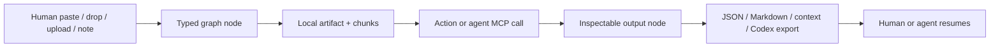

# Operator Loop

This is the practical contract for how Starlight Agent Canvas should feel to a human operator and how Codex, Claude, Gemini, or another MCP client should use the same state.

## Promise

The canvas is not a screenshot of research. It is the shared working surface where human context capture and agent actions meet:



## Human Interaction Loop

1. Start from the first viewport, not a docs page.
2. Use `New` for a blank graph or `Demo` for a proof canvas.
3. Use `Video`, `Image`, `Web`, `Note`, or `Ask` when the top composer is the fastest path.
4. Use the graph command tray when attention is already on the canvas: `Source`, `Paste & Map`, `File`, `Note`, `Ask`, `Context`, `Codex`.
5. Paste or drop YouTube, non-YouTube video links, image URLs/screenshots, web URLs, files, transcripts, rough notes, or mixed text. The clipboard button maps immediately when the browser allows it; when clipboard reads are blocked or empty, the composer stays focused for `Ctrl+V`, typing, or drop-to-canvas intake.
6. Confirm the preview chips before mapping.
7. Choose `Map + Brief`, `Claims`, `Ask`, or `Map only`.
8. Inspect the selected node receipt for artifact kind, ingest mode, source URL/path, chunks, and character count.
9. Run source-scoped actions when one source matters, or canvas actions when synthesis matters.
10. Export `Context` for general agent packets, `Codex` for ready-to-paste Codex continuation prompts, `Markdown` for people, or `JSON` for portable rehydration. If nodes are selected, those exports stay scoped to the selected evidence.

## Agent Interaction Loop

Agents should use the MCP server as a typed local operating surface, not as a generic note bucket.

1. `get_latest_canvas` when the human means the active/recent canvas, or `list_canvases` and `get_canvas` when a specific canvas matters.
2. Read existing nodes/artifacts before writing.
3. Use `ingest_anything` for messy pasted context so MCP mirrors the human canvas intake.
4. Use source-ingest tools when the source type is already known: `ingest_text_source`, `ingest_url`, `ingest_youtube`, `ingest_video`, `ingest_image`, or `ingest_pdf`.
5. Use `position` for generated nodes so the human opens a legible map.
6. Use `connect_nodes` to make evidence relationships visible.
7. Use `run_node_action` for summaries, claims, comparisons, matrices, implementation briefs, or cited answers.
8. Use `update_node` for cleanup instead of duplicating messy nodes.
9. Use `export_canvas` with `format: "codex"` when Codex should continue through MCP, or `format: "context"` when the next agent turn needs a self-contained packet. Pass `nodeIds` when the human selected a smaller evidence set.
10. Report node ids, artifact ids, chunk ids, and actions changed.

## Source Semantics

| Source | Node | Artifact | Contract |
| --- | --- | --- | --- |
| Human note | `note` | `manual` when ingested as source | Editable thought, usable as context |
| Public URL | `source_url` | `url` | Bounded fetch or safe reference fallback |
| PDF upload | `source_pdf` | `pdf` | Local text extraction, capped size |
| YouTube | `source_youtube` | `youtube` | Transcript-first, manual transcript fallback, no video download |
| Loom/Vimeo/direct video/Drive/Dropbox/etc. | `source_video` | `video` | Reference-first with attached transcript/notes; provider transcript adapters are future work |
| Image URL or uploaded screenshot | `source_image` | `image` | Reference/upload first with attached visual notes or OCR text; provider vision/OCR adapters are future work |
| Agent output | `output` | none by default | Inspectable result with citations/run metadata when available |

## Health Contract

Use these commands as the operator confidence loop:

```powershell
pnpm doctor
pnpm doctor:json
pnpm release:audit
pnpm canvas:smoke
pnpm mcp:smoke
pnpm verify
pnpm test:e2e
```

`pnpm doctor` is the human-readable status check. `pnpm doctor:json` is the machine-readable contract for agents, CI, and future setup UI. It reports:

- repo root
- canvas data home
- MCP CLI path
- Codex config path
- pass/warn/fail checks
- next setup actions

Warnings are allowed for optional wiring, such as Codex not yet pointing at this local MCP server. Failures mean the repo cannot be treated as a healthy local install.

## GitHub Contributor Loop

1. Clone and run `node scripts/setup.mjs`.
2. Run `pnpm doctor:json` and inspect `summary.fail`.
3. Use the issue template that matches the work: bug, feature, integration, or setup/MCP help.
4. Keep runtime data out of Git: no `.agent-canvas`, `.env`, `.next`, `node_modules`, or private exports.
5. Use the PR template to declare which surface changed: UI, core/store/actions, MCP, ingestion, docs/GitHub, tests/CI.
6. For UI changes, update visual QA evidence.
7. For MCP/install changes, update `docs/codex-integration.md`, `docs/mcp-setup.md`, or this operator loop.

## Done Definition For A Real Workflow

A workflow is not complete when a node merely appears. It is complete when:

- the source is typed correctly
- provenance is visible
- chunks or context are available for citation
- the human can inspect/edit the result
- an agent can read the same state through MCP
- export works in the required format
- Codex can resume from a handoff prompt or MCP `get_canvas`
- the work can be resumed later from local data or portable JSON
