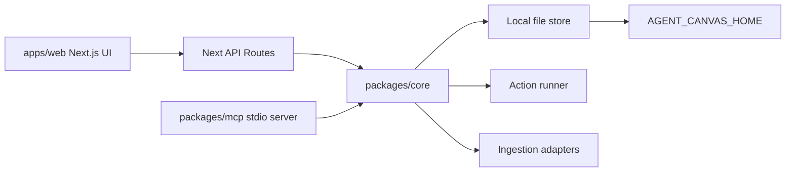

# System Design

## Architecture

## Data Boundary

Runtime data is local and defaults to the user's home `.starlight/agent-canvas` folder. The repo only stores examples, docs, and source code.
Canvas IDs are validated as safe slugs, and every file path is resolved under the configured canvas directory before read/write. Mutations are serialized per canvas and written through temp-file rename.

## Canvas Record

Each canvas stores:

- metadata
- typed nodes
- typed edges
- action runs
- source artifacts

Source ingestion writes both an artifact record and a typed node. The node is what users manipulate on the graph; the artifact is the durable source/provenance record used by search, export, and citation work.

Artifacts include deterministic source chunks with ids, index, text, and body offsets. Older exports without chunks remain valid; the core can derive chunks from artifact body text when needed.

The web inspector resolves a selected node back to its artifact to show a context receipt: artifact kind, ingest method, chunk count, source, character count, chunk preview, selected-source actions, and a selected context copy packet. The main action drawer can still use whole-canvas or multi-selected context.

Portable JSON import validates the same canvas record schema used by exports. Imports preserve the incoming id when it is new to the local home; when that id already exists, the store creates a non-destructive copy with a fresh canvas id and updated timestamps.

Exports have three roles: JSON is portable state, Markdown is a readable handoff, and context is an agent packet with operating contract, node index, source chunk manifest, evidence corpus, recent runs, and continuation prompt.

## Operator Health

`scripts/doctor.mjs` is the local readiness check for humans and agents. The default terminal output is optimized for setup help; `pnpm doctor:json` emits a stable JSON contract with repo root, canvas data home, MCP CLI path, Codex config path, pass/warn/fail checks, and next steps. Required failures exit non-zero. Optional integration gaps, such as Codex not yet wired to this MCP server, remain warnings so a fresh clone can still install and run before the user chooses to mutate MCP client config.

## Node Kinds

`note`, `source_url`, `source_pdf`, `source_youtube`, `source_video`, `prompt`, `mcp_tool`, `agent_run`, `output`

## Edge Kinds

`references`, `derives_from`, `compares`, `runs`, `exports`

## Action Runner

v0.1 ships deterministic local actions: summarize, extract claims, compare sources, decision matrix, implementation brief, and source-grounded question answering. Provider-backed AI is a future adapter, not a hard dependency.

## MCP Boundary

The MCP server exposes safe local tools only. It can list/get/create/import canvases, add/update/ingest positioned nodes, ingest text/URL/YouTube/video/PDF sources, connect nodes, run actions, search node/artifact/chunk evidence, and export. It never posts, pays, scrapes social platforms, or deletes data.

## Network Boundary

The Next.js API is localhost-only unless `AGENT_CANVAS_ALLOW_REMOTE=1` is set. URL ingestion rejects localhost/private networks and unsupported schemes, applies timeout and byte limits, and uses Firecrawl only when explicitly requested. PDF ingestion validates type and size before parse. YouTube ingestion is transcript-first: manual transcript, best-effort public captions, then metadata/reference fallback. Generic video ingestion is reference-first: Loom, Vimeo, Wistia, TikTok, Drive, Dropbox, and direct video links become `source_video` nodes with `video` artifacts, optional manual transcript/notes, chunks, and provenance, without downloading or rehosting media.
