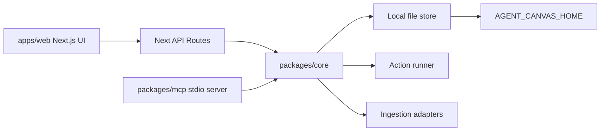

# System Design

## Architecture

## Data Boundary

Runtime data is local and defaults to the user's home `.starlight/agent-canvas` folder. The repo only stores examples, docs, and source code.
Canvas IDs are validated as safe slugs, and every file path is resolved under the configured canvas directory before read/write. Mutations are serialized per canvas and written through temp-file rename.

## Canvas Record

Each canvas stores:

- metadata
- typed nodes
- typed edges
- action runs
- source artifacts

## Node Kinds

`note`, `source_url`, `source_pdf`, `source_youtube`, `prompt`, `mcp_tool`, `agent_run`, `output`

## Edge Kinds

`references`, `derives_from`, `compares`, `runs`, `exports`

## Action Runner

v0.1 ships deterministic local actions. Provider-backed AI is a future adapter, not a hard dependency.

## MCP Boundary

The MCP server exposes safe local tools only. It never posts, pays, scrapes social platforms, or deletes data.

## Network Boundary

The Next.js API is localhost-only unless `AGENT_CANVAS_ALLOW_REMOTE=1` is set. URL ingestion rejects localhost/private networks and unsupported schemes, applies timeout and byte limits, and uses Firecrawl only when explicitly requested. PDF ingestion validates type and size before parse.
