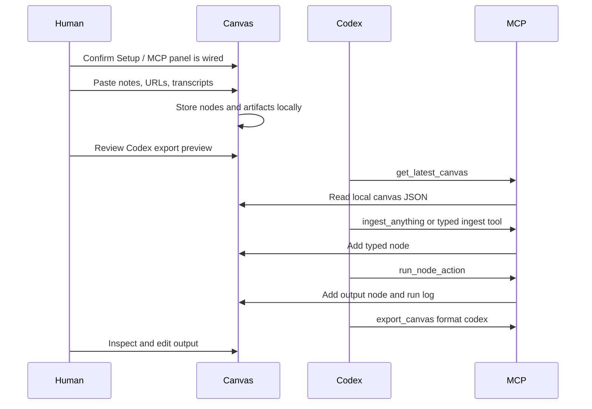

# User Flows

## Flow 1: First Canvas Session

```mermaid
flowchart LR
  open["Open blank canvas"] --> paste["Paste source into canvas composer"]
  paste --> preview["Review detected source chips"]
  preview --> map["Click Map"]
  map --> inspect["Inspect receipt and edit node"]
  inspect --> scope["Confirm selected context and Codex export preview"]
  scope --> ready["Check handoff readiness"]
  ready --> action["Run selected-source action"]
  action --> export["Export JSON or Markdown"]
```

Expected result: the user can use either the top composer or the center empty-canvas capture box as the first input surface. The live operator loop shows Capture, Map, Inspect, Ask, and Handoff state from real canvas data. The user sees what will be created before mapping, the new typed source node is selected, the viewport frames the new source/action cluster, the inspector opens a context receipt with chunks/provenance, source-grounded actions run without leaving the first screen, and the handoff lane shows whether the canvas is ready for Codex.

## Flow 1A: Self-Serve Quick Starter

1. Open any canvas.
2. Click `New` when you want a fresh blank graph instead of the latest local canvas.
3. Click `Video`, `Image`, `Web`, `Note`, or `Ask` in the first-viewport composer.
4. Confirm the composer focuses and the status explains the selected mode.
5. If the primary `Map + Brief` action is clicked before adding context, confirm it focuses the composer instead of silently doing nothing.
6. Paste or drop context.
7. Confirm the visible loop remains clear: `Drop -> Map -> Ask -> Handoff`.
8. Confirm the live operator loop advances from `Capture` to `Map` after source nodes exist.
9. Choose `Map + Brief`, `Claims`, `Ask`, or `Map only`.
10. Use the loop's `Inspect`, `Ask`, and `Codex` controls as direct next actions when the canvas state is ready.
11. Check handoff readiness: evidence, synthesis, selected scope, and Codex/MCP status.
12. Review the Codex export preview for included nodes, chunks, edges, runs, and excluded nodes.
13. Inspect the created nodes and use `Context`, `Codex`, or MCP `export_canvas` for handoff. With selected nodes, handoff stays scoped to the selected evidence.

Expected result: a new user can populate the canvas without reading docs or discovering hidden shortcuts.

## Flow 1B: One-Click Demo Proof

1. Open the app.
2. Click `Demo` in the first-viewport composer or toolbar.
3. Confirm the canvas loads the bundled demo and selects `Nodeflow-style video source`.
4. Inspect the receipt: `youtube`, `manual transcript`, source URL, chunks, and character count.
5. Click `Context` to copy the agent packet, click `Codex` to copy the Codex continuation prompt, or export JSON/Markdown.
6. Ask Codex/Claude/Gemini through MCP to list canvases and read the same imported canvas.

Expected result: a first-time user can see the complete product loop in seconds without locating example files manually.

## Flow 2: YouTube Research

1. Paste a YouTube URL into the canvas composer.
2. Add a manual transcript or notes in the same box when captions are unavailable.
3. Confirm the intake preview shows `Video source` and `manual transcript attached`.
4. Click `Map`.
5. Confirm the created video node is selected and visible in the inspector.
6. Confirm the context receipt shows `youtube`, `manual transcript`, source URL, chunks, and character count.
7. Run `Ask selected`, `Source summary`, or `Extract claims`.
8. Copy selected source context when Codex/Claude/Gemini should use only that source.
9. Click a citation in the output inspector and confirm the source node refocuses with the cited chunk highlighted.
10. Click the same citation from the run log when re-entering older answers.
11. Search a claim or transcript phrase and jump back to the source node.
12. Export the output node as part of the canvas.

Design note: YouTube ingestion is transcript-first. The app tries title lookup and captions, but manual transcript fallback is part of the core product path.

## Flow 2A: Non-YouTube Video Reference

1. Click `Video`.
2. Paste a Loom, Vimeo, Wistia, TikTok, Twitch, Dailymotion, Streamable, Frame.io, common social video, Drive, Dropbox, or direct video URL.
3. Paste notes or a manual transcript beneath the URL when available.
4. Confirm the intake preview shows `Video link` with `manual notes attached` when notes are present.
5. Click `Map only` when you want the raw video reference node, or `Map + Brief` when you want an immediate output.
6. Export JSON/context and confirm the source is a `source_video` node with a `video` artifact and `media: video_reference` provenance.

Expected result: the canvas accepts arbitrary video links as local context references without claiming unsupported video download or platform transcription.

## Flow 2B: Image Evidence

1. Click `Image`.
2. Paste an image URL with visual notes, or drop/upload a PNG, JPEG, WebP, GIF, or AVIF screenshot.
3. Confirm the intake preview shows `Image source` when a URL is detected.
4. Click `Map only` for raw visual evidence, or `Map + Brief` when you want immediate synthesis from the attached notes/OCR text.
5. Confirm the graph node and inspector show an image preview.
6. Confirm the context receipt shows `image`, `image reference` or `image upload`, source URL/file, chunks, and character count.
7. Export JSON/context and confirm the source is a `source_image` node with an `image` artifact and `imageUrl` or `imageDataUrl` provenance.

Expected result: the canvas accepts visual context as first-class local evidence without claiming OCR or model-backed image understanding until notes or provider vision are added.

## Flow 3: Competitor Teardown

1. Launch the `Competitor teardown` template.
2. Inspect the Workflow Map: capture evidence, normalize capabilities, compare wedges, decide build path, handoff to Codex.
3. Paste competitor URLs, videos, and notes into the Poppy, Nodeflow, AI Flow Chat, and Superly source slots.
4. Click each workflow stage to focus the relevant prompt/output node.
5. Pick the edge kind in the canvas toolbar, then connect related claims with `references` or `compares` edges.
6. Run `Claims`, `Compare`, `Matrix`, or `Build Brief` against selected evidence.
7. Export Markdown for human planning or `Codex` for implementation continuation.

## Flow 4: Human Note-Making

1. Double-click blank canvas space.
2. Or drop text onto the canvas.
3. Or click `Note` in the composer, empty canvas panel, toolbar, or inspector empty state.
4. Edit title/body in the inspector.
5. Confirm the receipt shows the note body as source context.
6. Connect it to source nodes.
7. Confirm the selected context tray shows the intended nodes.
8. Ask the canvas a question over selected nodes.

## Flow 5: Codex Uses The Same Canvas

Expected result: human and agent work on the same local state with explicit, reviewable mutations. When the agent receives a messy pasted source blob, `ingest_anything` mirrors the web canvas intake and maps YouTube, video, image, URL, and note context without making the user pick a lower-level tool.

## Flow 5A: Guided Workflow Template

1. Open the app.
2. Click a template such as `Competitor teardown`, `Repo/product planning`, `Agent workflow design`, or `Content synthesis`.
3. Confirm the template card shows its starter stages and expected outcome before launch.
4. Confirm the new canvas contains ordered workflow nodes, source slots, prompt nodes, output targets, and MCP/Codex handoff nodes.
5. Use the `Workflow map` in the Action Drawer to focus each stage.
6. Replace placeholder source slots with real links, transcripts, files, and notes.
7. Run actions and export selected evidence when the workflow reaches a useful output.

Expected result: templates are not decorative examples; they are reusable operating maps for the workflows this product is supposed to prove.

## Flow 6: Setup And Codex Activation

1. Open the app.
2. Inspect the `Setup / MCP` panel.
3. Confirm data home, MCP build, Codex config, and Codex server status.
4. Follow the `Activation runway`: install health, proof canvas, source mapping, context export, and Codex MCP wiring.
5. Copy `Setup`, `Codex`, `Smoke`, `first-run check`, or `prod preview` commands when a status needs action.
6. Inspect the `Agent toolbelt`: `get_latest_canvas`, `ingest_anything`, `run_node_action`, and `export_canvas`.
7. Copy the agent prompt, adoption report command, or terminal Codex handoff command when the next step should move from UI to Codex.
8. Copy the Codex activation prompt when Codex should continue from the current local canvas.
9. Restart Codex after installing MCP config.
10. Run `pnpm doctor:json` or `pnpm adoption:report:json` when an agent, CI job, or setup helper needs parseable readiness.
11. Ask Codex to list canvases through MCP.

Expected result: install and agent wiring status are visible inside the product surface, the next human action is obvious, and the write path remains explicit and backed by local scripts.

## Flow 7: Mobile Review

1. Open the app on a mobile viewport.
2. Use the top composer to map a short note or link.
3. Review the graph below the composer.
4. Scroll to rails, setup status, and inspector for detailed editing/actions.

Mobile is intended for review and light intake in v0.1, not dense graph authoring.

## Flow 8: Export, Import, And Handoff

1. Complete source mapping and actions.
2. Click `Context` for an agent packet, `Codex` for a ready-to-paste Codex prompt, `JSON` for portable state, or `MD` for readable handoff.
3. Select one or more nodes first when the export should include only those sources/notes/outputs and their linked artifacts.
4. Review the Codex export preview: exact nodes, source/chunk counts, internal edges, related runs, excluded nodes, and scope rules.
5. Attach the export to a PR, issue, Codex task, or project brief.
6. Re-import the JSON from the canvas toolbar or through MCP when you want to rehydrate the exact graph later.
7. Review the import preview before local state changes: title, file name, node/artifact/edge/run counts, node-kind mix, sample nodes, and conflict status.
8. Cancel if the file is wrong, or confirm to import.
9. Confirmed imports select the first useful source node so the receipt, chunks, provenance, and selected context are inspectable immediately.
10. If the canvas id already exists locally, import creates a non-destructive copy instead of overwriting active work.

Expected result: a canvas can move between human review, repo artifacts, Codex/Claude/Gemini MCP sessions, and later local rehydration without becoming a dead screenshot. The context packet gives agents metadata, a node index, source chunk manifest, evidence corpus, recent runs, and a continuation prompt; the Codex export wraps that packet in an explicit MCP resume instruction.

## Flow 9: Operator Health Loop

1. Clone or open the repo.
2. Run `node scripts/setup.mjs` for the full first-run path.
3. Run `pnpm doctor` for human-readable readiness.
4. Run `pnpm doctor:json` for machine-readable readiness.
5. Run `pnpm adoption:report` for the combined install, release, demo, visual, GitHub, and Codex snapshot.
6. Run `pnpm adoption:report:json` when Codex, CI, or another automation needs to parse that same adoption state.
7. Confirm `summary.fail` is `0` in doctor and release audit sections.
8. Treat Codex config warnings as optional until MCP is intentionally installed.
9. Run `pnpm release:audit`, `pnpm canvas:smoke`, and `pnpm mcp:smoke` before a release or important handoff.

Expected result: a contributor, operator, or agent can prove local health without reading implementation files or guessing which warnings are release blockers.
