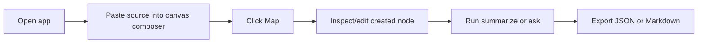
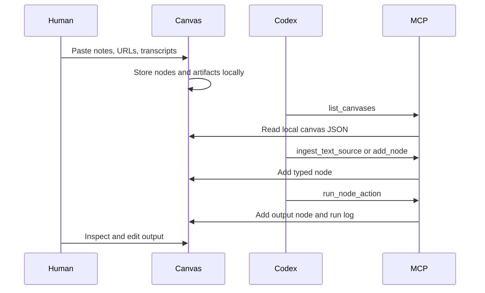

# User Flows

## Flow 1: First Canvas Session

Expected result: the user sees a typed source node, can edit it in the inspector, and can run source-grounded actions without leaving the first screen.

## Flow 2: YouTube Research

1. Paste a YouTube URL into the canvas composer.
2. Add a manual transcript or notes in the same box when captions are unavailable.
3. Click `Map`.
4. Confirm the created node is selected and visible in the inspector.
5. Run `Claims` or `Ask Canvas`.
6. Export the output node as part of the canvas.

Design note: YouTube ingestion is transcript-first. The app tries title lookup and captions, but manual transcript fallback is part of the core product path.

## Flow 3: Competitor Teardown

1. Launch the `Competitor teardown` template.
2. Paste competitor URLs, videos, and notes.
3. Connect related claims with `references` or `compares` edges.
4. Run `Compare` and `Matrix`.
5. Run `Build Brief`.
6. Export Markdown for implementation planning.

## Flow 4: Human Note-Making

1. Double-click blank canvas space.
2. Select the new note.
3. Edit title/body in the inspector.
4. Connect it to source nodes.
5. Ask the canvas a question over selected nodes.

## Flow 5: Codex Uses The Same Canvas

Expected result: human and agent work on the same local state with explicit, reviewable mutations.

## Flow 6: Mobile Review

1. Open the app on a mobile viewport.
2. Use the top composer to map a short note or link.
3. Review the graph below the composer.
4. Scroll to rails and inspector for detailed editing/actions.

Mobile is intended for review and light intake in v0.1, not dense graph authoring.

## Flow 7: Export And Handoff

1. Complete source mapping and actions.
2. Click `JSON` for portable state or `MD` for readable handoff.
3. Attach the export to a PR, issue, Codex task, or project brief.
4. Re-import or rehydrate later through core APIs or future CLI flows.

