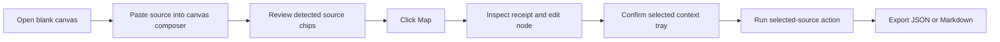
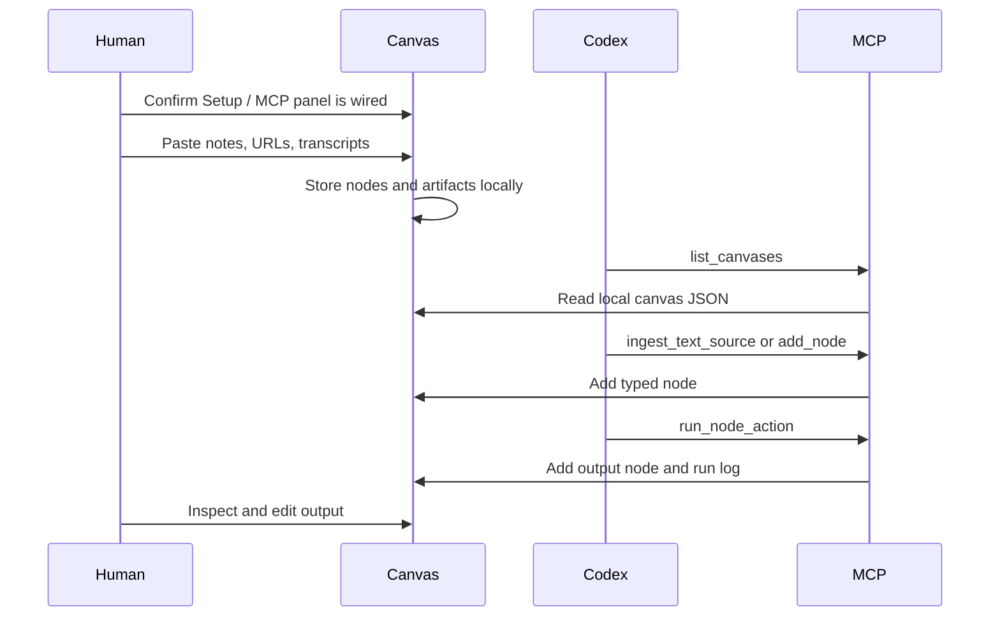

# User Flows

## Flow 1: First Canvas Session

Expected result: the user sees what will be created before mapping, the new typed source node is selected, the inspector opens a context receipt with chunks/provenance, and source-grounded actions run without leaving the first screen.

## Flow 1A: Self-Serve Quick Starter

1. Open any canvas.
2. Click `Video`, `Web`, `Note`, or `Ask` in the first-viewport composer.
3. Confirm the composer focuses and the status explains the selected mode.
4. Paste or drop context.
5. Confirm the visible loop remains clear: `Drop -> Map -> Ask -> Handoff`.
6. Choose `Map + Brief`, `Claims`, `Ask`, or `Map only`.
7. Inspect the created nodes and use `Context` or MCP `export_canvas` for handoff.

Expected result: a new user can populate the canvas without reading docs or discovering hidden shortcuts.

## Flow 1B: One-Click Demo Proof

1. Open the app.
2. Click `Demo` in the first-viewport composer or toolbar.
3. Confirm the canvas loads the bundled demo and selects `Nodeflow-style video source`.
4. Inspect the receipt: `youtube`, `manual transcript`, source URL, chunks, and character count.
5. Click `Context` to copy the agent packet, or export JSON/Markdown.
6. Ask Codex/Claude/Gemini through MCP to list canvases and read the same imported canvas.

Expected result: a first-time user can see the complete product loop in seconds without locating example files manually.

## Flow 2: YouTube Research

1. Paste a YouTube URL into the canvas composer.
2. Add a manual transcript or notes in the same box when captions are unavailable.
3. Confirm the intake preview shows `Video source` and `manual transcript attached`.
4. Click `Map`.
5. Confirm the created video node is selected and visible in the inspector.
6. Confirm the context receipt shows `youtube`, `manual transcript`, source URL, chunks, and character count.
7. Run `Ask selected`, `Source summary`, or `Extract claims`.
8. Copy selected source context when Codex/Claude/Gemini should use only that source.
9. Inspect the cited node/chunk ids in the output inspector.
10. Search a claim or transcript phrase and jump back to the source node.
11. Export the output node as part of the canvas.

Design note: YouTube ingestion is transcript-first. The app tries title lookup and captions, but manual transcript fallback is part of the core product path.

## Flow 2A: Non-YouTube Video Reference

1. Click `Video`.
2. Paste a Loom, Vimeo, Wistia, TikTok, Drive, Dropbox, or direct video URL.
3. Paste notes or a manual transcript beneath the URL when available.
4. Confirm the intake preview shows `Video link` plus `Source notes` when notes are present.
5. Click `Map only` when you want the raw reference and notes as separate nodes, or `Map + Brief` when you want an immediate output.
6. Export JSON/context and confirm the source keeps `media: video_reference` provenance.

Expected result: the canvas accepts arbitrary video links as local context references without claiming unsupported video download or platform transcription.

## Flow 3: Competitor Teardown

1. Launch the `Competitor teardown` template.
2. Paste competitor URLs, videos, and notes.
3. Pick the edge kind in the canvas toolbar, then connect related claims with `references` or `compares` edges.
4. Run `Compare` and `Matrix`.
5. Run `Build Brief`.
6. Export Markdown for implementation planning.

## Flow 4: Human Note-Making

1. Double-click blank canvas space.
2. Or drop text onto the canvas.
3. Or click `Note` in the composer, empty canvas panel, toolbar, or inspector empty state.
4. Edit title/body in the inspector.
5. Confirm the receipt shows the note body as source context.
6. Connect it to source nodes.
7. Confirm the selected context tray shows the intended nodes.
8. Ask the canvas a question over selected nodes.

## Flow 5: Codex Uses The Same Canvas

Expected result: human and agent work on the same local state with explicit, reviewable mutations.

## Flow 6: Setup And Codex Activation

1. Open the app.
2. Inspect the `Setup / MCP` panel.
3. Confirm data home, MCP build, Codex config, and Codex server status.
4. Copy `Setup`, `Codex`, or `Smoke` commands when a status needs action.
5. Restart Codex after installing MCP config.
6. Ask Codex to list canvases through MCP.

Expected result: install and agent wiring status are visible inside the product surface, while the write path remains explicit and backed by local scripts.

## Flow 7: Mobile Review

1. Open the app on a mobile viewport.
2. Use the top composer to map a short note or link.
3. Review the graph below the composer.
4. Scroll to rails, setup status, and inspector for detailed editing/actions.

Mobile is intended for review and light intake in v0.1, not dense graph authoring.

## Flow 8: Export, Import, And Handoff

1. Complete source mapping and actions.
2. Click `Context` for an agent packet, `JSON` for portable state, or `MD` for readable handoff.
3. Attach the export to a PR, issue, Codex task, or project brief.
4. Re-import the JSON from the canvas toolbar or through MCP when you want to rehydrate the exact graph later.
5. If the canvas id already exists locally, import creates a non-destructive copy instead of overwriting active work.

Expected result: a canvas can move between human review, repo artifacts, Codex/Claude/Gemini MCP sessions, and later local rehydration without becoming a dead screenshot. The context packet gives agents metadata, a node index, source chunk manifest, evidence corpus, recent runs, and a continuation prompt.
